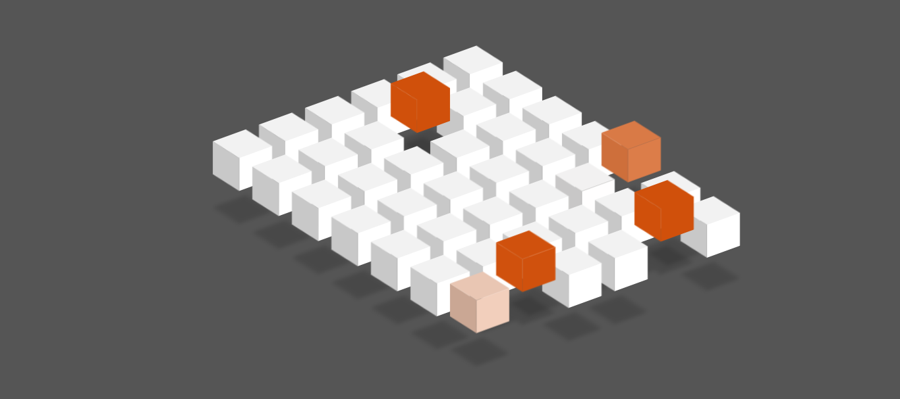

# Introduction

Multiple group cube by html, css and javascript.

## Features

- HTML container elements
- HTML list
- CSS variable
- CSS layouts
- CSS positioning
- CSS transform and transition
- CSS box-model
- CSS filter
- CSS animation
- JS function
- JS DOM manipulation
- JS array
- JS math methods
- JS setTimeout/setInterval methods

## Tools

- HTML
- CSS
- JavaScript

## Screenshot

